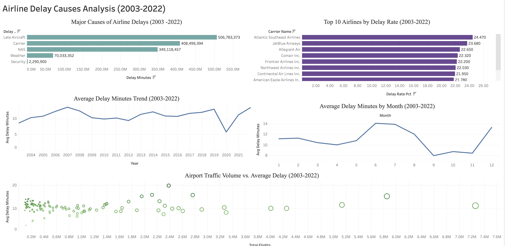

# Airline Delay Analysis (2003–2022)

> Analyzed 318,000+ U.S. flight records across 33 airlines and 420 airports over a 20-year period to identify the primary causes of airline delays, evaluate airline and airport performance, uncover seasonal and long-term trends, and translate findings into actionable operational recommendations.

## 🔍 Overview

* **Dataset:** Airline Delay Cause Dataset (Kaggle)
* **Coverage:** 318,017 records, 33 airlines, 420 airports, 2003–2022
* **Tools Used:** SQL (SQLite), Tableau Public
* **Skills Demonstrated:** Data Cleaning, Data Validation, SQL Querying, Exploratory Data Analysis (EDA), Root Cause Analysis, Trend Analysis, Data Visualization, Dashboard Development, Data Storytelling, Business Analysis

## 📌 Business Questions

1. What delay causes contribute most to industry-wide delays?
2. Which airlines have the highest delay burden relative to flight volume?
3. Which airports act as operational bottlenecks?
4. How do delay patterns vary across months and seasons?
5. How have airline delays evolved from 2003–2022?

## 🧹 Data Cleaning & Validation

Before analysis, several data quality checks were performed:

* Identified 4 records with missing carrier information, all occurring in August 2008. The issue was isolated and determined unlikely to affect overall results.
* Checked for duplicate airline-airport-month observations; no duplicates were found.
* Validated year values (2003–2022) and month values (1–12).
* Created a cleaned analysis table while preserving the original dataset for reference.

## 🛠️ Analysis Approach

1. Conducted exploratory analysis to understand dataset size, airline coverage, airport coverage, and time span.
2. Evaluated airline performance using delay rate and average delay metrics rather than total delay minutes alone, preventing larger airlines from appearing worse simply because they operated more flights.
3. Created dedicated SQL summary tables for each business question.
4. Exported summary tables and developed visualizations in Tableau Public.
5. Combined findings into an interactive dashboard for stakeholder reporting.

   **Note:** This repository contains the SQL workflow used during the analysis phase. Non-SQL activities such as dataset selection, business question development, Tableau dashboard creation, and project documentation are covered in the accompanying case study and project log.

### Sample SQL

SELECT
    carrier_name,
    SUM(arr_del15) AS total_delayed_flights,
    SUM(arr_flights) AS total_flights,
    ROUND(SUM(arr_delay) * 1.0 / SUM(arr_flights), 2) AS avg_delay_per_flight,
    ROUND(SUM(arr_del15) * 100.0 / SUM(arr_flights), 2) AS delay_rate_pct
FROM Airline_Delay_Clean
GROUP BY carrier_name
HAVING SUM(arr_flights) > 10000
ORDER BY delay_rate_pct DESC;

## 📊 Dashboard

Interactive Tableau dashboard combining all five business questions into a single view, allowing users to explore delay causes, airline performance, airport bottlenecks, seasonal patterns, and long-term trends.

**View Interactive Tableau Dashboard:**
**[View Interactive Tableau Dashboard](https://public.tableau.com/views/AirlineDelayCausesAnalysis/Dashboard1?language=en-GB&:sid=&:display_count=n&:origin=viz_share_link)**

### Dashboard Preview

## 💡 Key Findings

### Delay Causes

Late Aircraft Delay was the largest contributor to total delay minutes (37.9%), followed by Carrier Delay (30.6%) and NAS Delay (26.1%). Together, these three categories accounted for nearly 95% of all delay minutes, while Weather (5.2%) and Security (0.2%) played a minor role.

### Airline Performance

Delay rates varied significantly across airlines. Atlantic Southeast Airlines (24.5%), JetBlue Airways (23.7%), and Allegiant Air (22.7%) recorded the highest delay rates, while Hawaiian Airlines recorded the lowest delay rate, highlighting substantial differences in delay performance across carriers.

### Airport Bottlenecks

Newark Liberty, LaGuardia, San Francisco International, Chicago O'Hare, and JFK consistently combined high traffic volume with elevated average delays, making them critical pressure points in the broader flight network.

### Seasonal Trends

Delays followed a clear seasonal pattern. June, July, August, and December consistently experienced the highest delay levels, while September, October, and November recorded the lowest. June recorded the highest average delay per flight, with July and August close behind.

### Long-Term Trends

Delay performance fluctuated from 2003–2022, rising through the mid-2000s before stabilizing during the 2010s. Delays dropped sharply in 2020 during the COVID-19 pandemic before rebounding in 2021–2022 as travel demand recovered.

## ✅ Recommendations

### 1. Add Schedule Buffer to Early Aircraft Rotations

Since Late Aircraft Delay accounted for 37.9% of all delay minutes and tends to cascade across an aircraft's daily schedule, airlines should build 10–15 minute buffers into the first few daily rotations of high-frequency aircraft to prevent early delays from propagating throughout the day.

### 2. Benchmark Against High-Performing Carriers

Atlantic Southeast, JetBlue, and Allegiant should benchmark their operational performance against Hawaiian Airlines to identify practices associated with lower delay rates and stronger on-time performance.

### 3. Review Scheduling Density at Bottleneck Airports

Newark, LaGuardia, San Francisco, Chicago O'Hare, and JFK should reassess departure scheduling during peak congestion periods to reduce traffic clustering. Since NAS Delay is one of the largest delay categories, reducing congestion could significantly improve system performance.

### 4. Pre-Position Resources Ahead of Seasonal Peaks

Because June, July, August, and December consistently experience elevated delay levels, airlines should proactively allocate additional ground crews, reserve aircraft, and scheduling resources several weeks before peak travel periods rather than reacting after delays occur.

## 📁 Repository Contents

* Airline Delay Case Study.pdf
* Airline Delay Analysis – Business Insights & Findings.pdf
* Airline Delay Analysis – Project Log.pdf
* Dashboard Screenshot
* README.md

## 🔗 Links

* Tableau Public Dashboard: **[View Interactive Tableau Dashboard](https://public.tableau.com/views/AirlineDelayCausesAnalysis/Dashboard1?language=en-GB&:sid=&:display_count=n&:origin=viz_share_link)**
* Dataset Source: Airline Delay Cause Dataset (Kaggle)

## Skills Demonstrated

* SQL Querying
* Data Cleaning
* Data Validation
* Exploratory Data Analysis (EDA)
* Business Analysis
* Root Cause Analysis
* Trend Analysis
* Data Visualization
* Tableau Dashboard Development
* Data Storytelling

